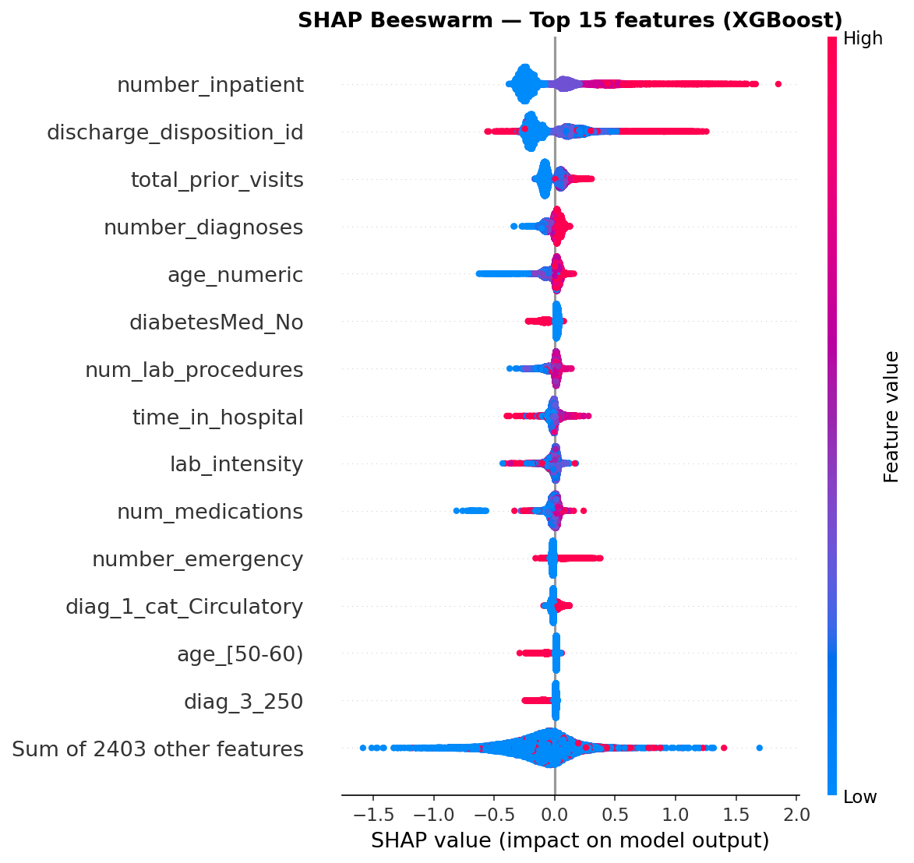

# Clinical Tabular ML — 30-Day Hospital Readmission

> **Clinical tabular ML with real-world missingness, class imbalance, interpretable risk scoring, and SQL-driven patient utilization analysis.**

**Dataset:** Diabetes 130-US Hospitals (UCI) · 99,343 encounters · 130 US hospitals · 1999–2008  
**Author:** Santiago Vega · [LinkedIn](https://linkedin.com/in/biotecvega) · [GitHub](https://github.com/santiagovega2002-b)

---

## Dashboard

> Live demo: [[link de Streamlit Cloud ](https://diabetesvega.streamlit.app/)]

---

## Problem Statement

Hospital readmission within 30 days of discharge is a critical indicator of care quality and operational efficiency. In diabetic patients — whose management involves multiple comorbidities, polypharmacy, and metabolic variability — early readmission rates are significantly higher than in the general population.

**Central question:** Is it possible to identify, at the time of discharge, which diabetic patients are at higher risk of readmission within 30 days, using only clinical and administrative variables available in the medical record?

---

## Results

| Model | ROC-AUC | PR-AUC |
|---|---|---|
| Logistic Regression (baseline) | 0.643 | 0.201 |
| Random Forest | 0.652 | 0.203 |
| **XGBoost (main model)** | **0.668** | **0.224** |

**At threshold=0.42 (F2-score optimized):**

| Metric | Value |
|---|---|
| Recall (positive class) | 0.738 |
| Precision (positive class) | 0.154 |
| Specificity | 0.490 |
| Brier Score | 0.210 |

The model detects **73.8% of real readmissions** in the test set. The default threshold of 0.5 was not used — threshold was tuned explicitly using F2-score, which weights recall twice as much as precision, reflecting the asymmetric cost structure of missed readmissions vs. unnecessary alerts.

---

## Methodology

### Split strategy — preventing leakage
The dataset contains patients with multiple encounters. A naive random split would leak patient information between train and test, inflating performance metrics. `GroupShuffleSplit` with `patient_nbr` as group ensures no patient appears in both sets.

```
Unique patients: 69,990 · Total encounters: 99,343
Average encounters per patient: 1.42
```

### Class imbalance
Only 11.4% of encounters are readmissions (<30 days). Accuracy is irrelevant as a metric.

- XGBoost: `scale_pos_weight = 7.74` (neg/pos ratio in train)
- Logistic Regression / Random Forest: `class_weight='balanced'`
- SMOTE evaluated as secondary experiment — not used as primary strategy

### Missingness — informative, not random
`A1Cresult` and `max_glu_serum` have ~75% missing values. These are not random errors — they reflect clinical measurement practices. Strategy:
- Original categorical value preserved when present (ordinal clinical signal)
- Binary flags `was_A1C_measured` and `was_glucose_measured` added
- `'?'` treated as explicit category `'Not measured'`, not imputed

### Feature engineering
| Feature | Construction | Rationale |
|---|---|---|
| `total_prior_visits` | sum(outpatient + emergency + inpatient) | Historical system utilization |
| `was_A1C_measured` | binary flag (A1Cresult != '?') | Informative missingness |
| `was_glucose_measured` | binary flag (max_glu_serum != '?') | Informative missingness |
| `n_meds_changed` | count of Up/Down across medications (excl. insulin, metformin) | Reduced dimensionality with signal |
| `diag_categoria_primaria` | ICD-9 grouped into 9 clinical categories | Reduces cardinality with clinical criterion |
| `lab_intensity` | num_lab_procedures / time_in_hospital | Diagnostic intensity per day |
| `insulin` (individual) | original variable preserved | Highest clinical plausibility in diabetes |
| `metformin` (individual) | original variable preserved | First-line T2D — change reflects therapeutic adjustment |

ICD-9 diagnosis variables (`diag_1`, `diag_2`, `diag_3`) were grouped into 9 standard clinical categories (CCS) instead of one-hot encoding ~900 unique codes.

### Threshold tuning
Default threshold of 0.5 is suboptimal under severe class imbalance with asymmetric costs. In hospital readmission, a false negative (missing a patient who will return) carries a higher clinical-operational cost than a false positive (unnecessary alert).

**F2-score** was used to select the optimal threshold — it weights recall twice as much as precision. Selected threshold: **0.42**.

---

## SHAP — Interpretability



**Top findings:**
- `number_inpatient` is the strongest predictor by a wide margin — prior hospitalization history
- `discharge_disposition_id` — discharge destination has high bidirectional impact
- `total_prior_visits` — historical system utilization confirms the signal (engineered feature)
- `number_diagnoses` — more active diagnoses associated with higher risk
- `insulin_Down` appears with positive signal in individual profiles — consistent with exploratory analysis showing dose reduction at discharge associated with higher readmission rate (14.2% vs 10.2%)

> **Methodological note:** SHAP shows statistical association, not causality. Features with high impact are not necessarily actionable. `number_inpatient` is the strongest predictor, but prior hospitalization is not a variable that can be acted upon at discharge.

---

## SQL-Driven Utilization Analysis

Eight analytical queries were developed using DuckDB to characterize patient utilization patterns:

- Readmission rate by number of prior hospitalizations
- Readmission by length of stay
- Top primary diagnoses (ICD-9) by readmission rate
- Readmission by medication load (polypharmacy)
- Readmission by discharge type
- Insulin change proportion by readmission class
- High-utilization subgroup analysis (3+ hospitalizations)
- Key metrics summary by age range

---

## Calibration

The model is **undercalibrated** — predicted probabilities are systematically higher than the actual proportion of positives. This is expected with `scale_pos_weight=7.74`. The model is useful for **relative risk ranking**, not for estimating absolute readmission probability.

---

## Stack

| Layer | Tool |
|---|---|
| EDA & processing | Python · pandas · numpy · matplotlib · seaborn |
| SQL analytics | DuckDB |
| Feature engineering | pandas · scikit-learn (Pipeline, ColumnTransformer) |
| ML — Baseline | scikit-learn LogisticRegression, RandomForestClassifier |
| ML — Main | XGBoostClassifier (scale_pos_weight) |
| Validation & metrics | scikit-learn (cross_val_score, roc_auc_score, average_precision_score) |
| Threshold tuning | Precision-Recall curve + F2-score |
| Interpretability | shap |
| Dashboard | Streamlit |
| Version control | Git · GitHub |
| Environment | Python 3.11 · Jupyter Notebooks · VSCode |

---

## Repository Structure

```
clinical-tabular-ml/
├── notebooks/
│   ├── 01_eda.ipynb
│   ├── 02_cleaning_sql.ipynb
│   └── 03_modeling.ipynb
├── data/
│   ├── raw/                  # Original dataset
│   └── processed/            # clean_data.parquet · features.parquet
├── models/
│   ├── xgb_readmission.pkl
│   └── threshold.txt
├── reports/figures/          # All plots and visualizations
├── queries/                  # Individual .sql files
├── app.py                    # Streamlit dashboard
├── requirements.txt
└── README.md
```

---

## Limitations

- The model predicts **historical association** with readmission, not causality. High-SHAP features are not necessarily actionable.
- Data covers **1999–2008**. Clinical practices, discharge protocols, and medication availability have changed significantly.
- Dataset originates from **130 US hospitals**. Generalization to other healthcare systems (LATAM, Europe) requires external validation.
- **Key clinical variables absent:** quantitative lab values (numeric HbA1c, blood glucose in mg/dL), vital signs, detailed comorbidities.
- Binary recoding of target (`<30d` vs. rest) discards information about late readmissions — a deliberate trade-off.
- This is a **methodological portfolio project**. No clinical implementation is proposed and no prospective evaluation is performed.

---

## Dataset

**Diabetes 130-US Hospitals for Years 1999–2008**  
UCI Machine Learning Repository  
[https://archive.ics.uci.edu/dataset/296/diabetes+130-us+hospitals+for+years+1999-2008](https://archive.ics.uci.edu/dataset/296/diabetes+130-us+hospitals+for+years+1999-2008)  
Public access · No use agreement required
